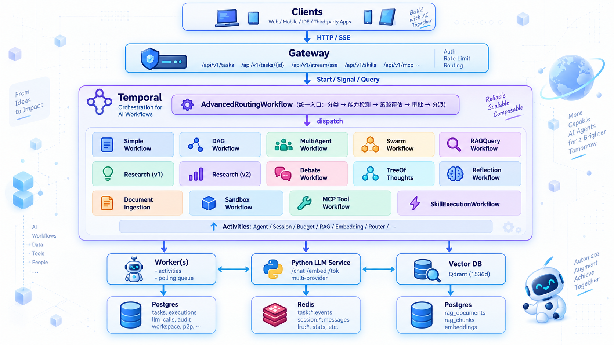

<p align="center">
  
</p>

# Cribug — Reliable Agents. Real Work.

> [快速开始](#本地启动) · [核心能力](#关键能力) · [架构总览](#架构总览) · [API 参考](#api-速览) · [开发约定](#开发约定)

[](#license)
[](go.mod)
[](python_llm_service/requirements.txt)
[](sandbox/runner/Cargo.toml)
[](#开发约定)

**Cribug** 是一个基于 [Temporal](https://temporal.io/) 的多 Agent LLM 编排平台。它把多模型推理、知识检索、工具调用、沙箱执行、Agent 间通信和人机协同审批等能力,统一封装成可观测、可恢复、可治理的工作流,对外提供一致的 REST/SSE API。

**[开始使用 →](#本地启动)** &nbsp; · &nbsp; [了解架构](#架构总览) &nbsp; · &nbsp; [查看 API](#api-速览)

---

## 项目定位

Cribug 解决的是「把一个用户请求,以合适的成本、合适的模型、合适的执行模式,可靠地跑完」这一类问题。它既支持单次 LLM 调用,也支持以下复杂执行模式:

- 单 Agent 简单问答
- 计划式多 Agent 链(planner / researcher / critic / synthesizer)
- DAG 任务图(节点并发、失败重规划、动态依赖传播)
- 群智 Swarm(Lead Agent + Worker 池,带 P2P 消息和共享 Workspace)
- RAG 检索增强问答
- 文档摄入与向量化入库
- 多模型辩论(Debate)
- 思维树(ToT)探索
- 反思循环(Reflection)
- 沙箱代码执行(Sandbox)
- MCP 工具调用
- 技能执行(Skills)

所有模式由统一的 `AdvancedRoutingWorkflow` 路由器根据任务复杂度、风险等级、能力需求、预算与策略自动选择执行路径,也支持调用方显式指定。

---

## 架构总览

[](docs/images/cribug-architecture.png)

---

## 核心组件

| 组件 | 角色 |
|------|------|
| **Gateway** (`cmd/gateway`) | 对外 REST/SSE 接口,负责请求校验、Temporal 启动、SSE 流转发 |
| **Worker** (`cmd/worker`) | 注册并执行所有 Workflows 与 Activities,接入 Temporal 任务队列 |
| **Temporal** | 持久化、可重试、可观测的 Workflow 引擎 |
| **Python LLM Service** (`python_llm_service`) | 多 Provider 适配层(OpenAI / Anthropic / DeepSeek / Groq / Qwen / Mistral / xAI / Google / Ollama),提供 `/chat`、`/embedding`、`/tokenize` |
| **Postgres** | 任务、执行、LLM 调用、审计、Workspace、P2P、审批、向量化等核心持久化 |
| **Redis** | 任务事件流、Session 消息、两级 LRU 缓存、Swarm 状态、统计 |
| **Qdrant** | 向量数据库,1536 维(MRL 截断),承载 RAG 与语义检索 |

---

## 工作流一览

所有工作流都注册在 Worker 中,由 `AdvancedRoutingWorkflow` 或调用方按需触发。

| Workflow | 用途 |
|----------|------|
| `AdvancedRoutingWorkflow` | 统一入口:任务分类 → 能力检测 → 策略评估 → 审批闸门 → 模式分派 |
| `SimpleWorkflow` | 单 Agent 直接问答,加载 Session、估算 Token、预算闸门、记录用量 |
| `DAGWorkflow` | 计划式任务图,支持并发节点、失败重规划、依赖传播 |
| `MultiAgentWorkflow` | planner → researcher → critic → synthesizer 顺序链 |
| `SwarmWorkflow` | Lead Agent + 多个 Worker,并发执行,带 P2P 消息与共享 Workspace |
| `RAGQueryWorkflow` | 检索增强问答:查询改写 → 检索 → 重排 → 生成 |
| `DocumentIngestionWorkflow` | 文档解析 → 分块 → Embedding → 入库 Qdrant |
| `ResearchSynthesisWorkflow` | 经典多步研究综合(搜索 → 综合) |
| `ResearchSynthesisV2Workflow` | 增强版研究综合,更精细的策略与子任务规划 |
| `DebateWorkflow` | 多模型/多角色辩论,达成一致结论 |
| `TreeOfThoughtsWorkflow` | 思维树探索,在多条思路中择优 |
| `ReflectionWorkflow` | 自我反思迭代,提升输出质量 |
| `SandboxWorkflow` | 在隔离沙箱中执行不可信代码 |
| `MCPToolCallWorkflow` | 通过 MCP 协议调用外部工具 |
| `SkillExecutionWorkflow` | 执行注册的 Skill(组合式能力单元) |

---

## 关键能力

### 统一路由器

`AdvancedRoutingWorkflow` 是所有任务的统一入口:

1. **任务分类** — `ClassifyTaskComplexityActivity` 评估复杂度与风险等级。
2. **能力检测** — `DetectTaskCapabilitiesActivity` 识别任务所需的工具、沙箱、研究等能力。
3. **策略评估** — `EvaluateRoutingPolicyActivity` 按 `config/router_policy.yaml` 中的阈值对每种模式打分,挑选最合适的执行模式;支持纯启发式与可选 LLM 分类器(`ROUTER_CLASSIFIER_ENABLED`)。
4. **审批闸门** — 高风险任务进入 Temporal Signal 等待,等待人工 `approve / reject / modify`;支持超时与 `ROUTER_REQUIRE_APPROVAL` kill switch。
5. **分派执行** — 按结果模式分派到下游 Workflow;同时把决策、信号、解释写入 `routing_audit_logs` 供回溯。
6. **预览接口** — `mode=preview` 可只返回路由决策、不真正执行,便于前端做能力检查与成本预估。

### 多 LLM Provider 适配

`python_llm_service` 抽象了多个 Provider,统一 `/chat`、`/embedding`、`/tokenize` 接口:

- `openai` / `minimax`(OpenAI 兼容)
- `anthropic`(Anthropic Messages 兼容)
- `google` Gemini 系列(含 `gemini-embedding-001` 1536 维 Embedding)
- `deepseek` / `groq` / `qwen` / `mistral` / `xai` / `ollama`

`tiktoken` 在 `EstimatePromptTokensActivity` 中估算 prompt token 数量,带两级 LRU 缓存(进程内 L1 + Redis L2),避免重复打 Python 服务。

### RAG 与文档摄入

- 文档摄入 `DocumentIngestionWorkflow` 解析、分块、调用 Embedding,写入 Postgres 的 `rag_documents` / `rag_chunks` 与 Qdrant 向量库。
- `RAGQueryWorkflow` 在回答前做语义检索,支持多轮改写、Top-K 控制与结果重排。
- Embedding 支持 Google / OpenAI / fake 三类,默认 1536 维(MRL 截断,可在 `EMBEDDING_DIMENSION` 调整)。

### 多 Agent 协作

- **MultiAgent**:planner / researcher / critic / synthesizer 顺序链,synthesizer 是唯一会触发真实 LLM 调用的角色,带预算闸门。
- **Swarm**:Lead + Worker 池,带 P2P 消息路由(`request` / `response` / `critique` / `observation` / `final` / `error`)、共享 Workspace、Signal 通道状态查询;通过 Temporal Selector + Timer + Signal 实现确定性多轮与状态同步。
- **DAG**:节点并发、依赖传播、失败时动态重规划(`skip_dependents` 策略),独立分支继续执行。
- **Debate / ToT / Reflection**:多模型/多路径探索,达成更高质量的最终答案。

### 工具 / MCP / 沙箱

- **Tools**:本地工具注册(calculator、echo 等),带按步度量与事件。
- **MCP**:`MCPToolCallWorkflow` 通过 stdio/HTTP 接入外部 MCP 工具。
- **Sandbox**:`SandboxWorkflow` 在隔离环境中执行不可信代码,带风险词检测与白名单。

### Skills

`SkillExecutionWorkflow` 把若干能力组合成可复用的 Skill 单元,通过 `internal/skillclient` 拉取与执行,带审计日志。

### Hooks 与审计

- `hooks` 模块允许在 Workflow 关键事件点(`AGENT_STARTED` / `LLM_STARTED` / `TOOL_CALL_STARTED` 等)插入钩子,支持外部可观测与策略拦截。
- 全链路事件写入 `audit_events`、`routing_audit_logs`、`approval_audit_logs`、`react_steps` 等,便于事后追溯。

### 预算与配额

`EstimatePromptTokensActivity` → `CheckBudgetActivity` 构成预算闸门,任何会触发外部 LLM 调用的 Activity 之前都过闸,避免超额消费。`RecordUsageActivity` 把真实 usage 落到 `llm_calls` 表。

### 会话与状态

- `LoadSessionActivity` / `SaveSessionActivity` 从 Redis `session:*:messages` 列表里取/存消息,默认 TTL ~7 天、最多 50 条。
- 长历史的 token 估算走 L1/L2 LRU 缓存,Stats 写入 `lru:stats` 哈希。
- Swarm 的 P2P 消息、Workspace 项、Signal 状态都通过 Temporal 的 SignalChannel + 工作流历史恢复。

### 事件流与 SSE

每个任务在 Redis 上有一个 `task:{id}:events` Stream,所有关键事件(`TASK_CREATED`、`WORKFLOW_STARTED`、`AGENT_STARTED`、`LLM_STARTED`、`TOOL_CALL_*`、`DAG_NODE_*`、`SWARM_*`、`P2P_*`、`TASK_COMPLETED` 等)按时间序写入,Gateway 通过 `/api/v1/stream/sse` 透传给前端。

---

## 路由策略示例

`config/router_policy.yaml` 控制复杂度阈值、风险等级、预算分档:

```yaml
thresholds:
  direct_answer_max:    0.15
  rag_min:              0.10
  react_min:            0.20
  dag_min:              0.35
  reflection_min:       0.30
  tree_of_thoughts_min: 0.55
  debate_min:           0.35
  research_v2_min:      0.50
  swarm_min:            0.65
  sandbox_min_risk:     "high"

risk:
  low_max: 0.30
  medium_max: 0.60
  high_max: 0.85
  critical_min: 0.85
  require_approval_min: "high"

budget:
  cheap_max_usd:    0.05
  medium_max_usd:   0.25
  expensive_min_usd: 0.50
```

`config/model_providers.yaml` 描述模型分档与小/中/大模型选型优先级。
`config/budget.yaml` 描述任务级 Token 与成本上限。
`config/features.yaml` 集中管理功能开关与运行时参数。

---

## 项目结构

```
cribug/
├── cmd/
│   ├── gateway/         # REST/SSE 入口
│   └── worker/          # Temporal Worker
├── internal/
│   ├── api/             # HTTP handler、router、middleware
│   ├── activities/      # 所有 Activity 实现
│   ├── workflows/       # 所有 Workflow 实现 + patterns
│   ├── llm/             # LLM 调用抽象
│   ├── rag/             # 检索相关
│   ├── embeddings/      # Embedding 适配
│   ├── vectordb/        # Qdrant 适配
│   ├── events/          # 事件流
│   ├── hooks/           # 钩子
│   ├── skillclient/     # Skill 客户端
│   ├── redis/           # Redis 适配
│   ├── db/              # Postgres 适配
│   ├── config/          # 配置加载
│   └── types/           # 共享类型
├── python_llm_service/  # 多 Provider Python 适配服务
│   ├── adapters/        # 各 Provider 适配
│   └── llm_service/     # 服务实现
├── migrations/          # SQL 迁移
├── config/              # YAML 配置
├── deploy/              # docker-compose、postgres-init
├── docs/                # 设计文档与报告
├── scripts/             # 启动 / 构建 / smoke test
└── testdata/            # 测试数据
```

---

## 本地启动

### 依赖

- Docker Desktop(或 Docker daemon)
- Go 1.24+
- Python 3.10+
- `curl`、`jq` 等常用 CLI

### 1. 启动基础设施

```bash
docker compose -f deploy/docker-compose.yaml up -d \
  postgres redis temporal temporal-ui qdrant
```

端口约定:

| 服务 | 容器内端口 | 主机端口 |
|------|----------|---------|
| Postgres | 5432 | 5432 |
| Redis | 6379 | 6379 |
| Temporal | 7233 | **17233** |
| Temporal UI | 8080 | **18088** |
| Qdrant | 6333 | 6333 |

> Temporal UI: <http://127.0.0.1:18088>

### 2. 准备环境变量

```bash
cp .env.example .env
# 按需填入 OPENAI_API_KEY / GOOGLE_API_KEY / ANTHROPIC_API_KEY 等
```

`.env.example` 已经按 section 组织好,涵盖:Core Runtime、Database、Redis、Temporal、Gateway、Feature Flags、LLM Provider、Embedding Provider、Vector DB、Router、Hooks、Skills、Sandbox、Mock 等。

### 3. 构建

```bash
bash scripts/build.sh
```

### 4. 启动三个进程

```bash
# 终端 1: Python LLM Service
bash scripts/run-llm-service.sh

# 终端 2: Gateway (默认 :8080)
bash scripts/run-gateway.sh

# 终端 3: Worker
bash scripts/run-worker.sh
```

启动顺序没有强依赖,但 Temporal 不可用时 Gateway 启动 Workflow 会失败,Worker 没事。

---

## API 速览

所有 API 前缀 `/api/v1`,详细请求/响应字段见 `internal/api/*_handlers.go` 与 `docs/`。

### 健康检查

```bash
curl --noproxy '*' -s http://127.0.0.1:8080/health | jq
```

### 创建任务(自动路由)

```bash
curl --noproxy '*' -s -X POST http://127.0.0.1:8080/api/v1/tasks \
  -H "Content-Type: application/json" \
  -d '{
    "query": "Compare transformer vs Mamba for long-context tasks",
    "session_id": "my-session",
    "config": {
      "mode": "auto",
      "model": "gpt-4o-mini",
      "temperature": 0.7,
      "max_total_tokens": 8000,
      "max_completion_tokens": 1024
    }
  }' | jq
```

`config.mode` 可选:`auto`(默认,走路由器) / `simple` / `dag` / `multi_agent` / `swarm` / `rag` / `research` / `research_v2` / `debate` / `tot` / `reflection` / `sandbox` / `mcp` / `skill` / `preview`(只返回路由决策,不下发执行)。

`config.enable_*` 字段用于开启 ReAct、Tools 等子能力,功能开关在 `config/features.yaml` 中。

### 查询任务

```bash
curl --noproxy '*' -s http://127.0.0.1:8080/api/v1/tasks/{task_id} | jq
```

返回 `status`(`running` / `completed` / `failed` / `budget_exceeded` / `waiting_approval` / `timeout` / `rejected` 等)、`result`、`usage`、`route_decision`、`audit_ref` 等字段。

### SSE 流

```bash
curl --noproxy '*' -N "http://127.0.0.1:8080/api/v1/stream/sse?task_id={task_id}"
```

事件按时间序实时推送,直到 `TASK_COMPLETED` / `TASK_FAILED` / `TASK_BUDGET_EXCEEDED` / `TASK_REJECTED` 等终止事件。

### 路由预览

```bash
curl --noproxy '*' -s -X POST http://127.0.0.1:8080/api/v1/tasks/route \
  -H "Content-Type: application/json" \
  -d '{ "query": "Write a Python script to plot x^2" }' | jq
```

返回 `mode` / `score` / `risk` / `estimated_cost` / `requires_approval` / `explanation`,不下发执行。

### 审批 / 拒绝 / 修改

任务进入 `waiting_approval` 后,可向 Temporal Workflow 发 Signal:

```bash
# 通过 Gateway 的封装接口
curl --noproxy '*' -s -X POST http://127.0.0.1:8080/api/v1/tasks/{task_id}/decision \
  -H "Content-Type: application/json" \
  -d '{ "decision": "approve" }' | jq
# decision: approve | reject | modify
```

### Skills / MCP / Sandbox / Hooks / LLM Config

均提供 REST 端点,见 `internal/api/skills_handlers.go` / `mcp_handlers.go` / `sandbox_handlers.go` / `hooks_handlers.go` / `llm_config_handlers.go`。

---

## 数据模型

核心表(见 `migrations/`):

| 表 | 用途 |
|----|------|
| `tasks` | 任务主表,状态、配置、结果、用量 |
| `executions` | 执行记录(每次重试一次) |
| `llm_calls` | 每次 LLM 调用的 prompt/response/usage/provider/model |
| `react_steps` | Workflow-level ReAct 审计(Reason/Act/Synthesis) |
| `agent_messages` | Swarm P2P 消息 |
| `workspace_entries` | Swarm 共享 Workspace |
| `documents` / `rag_chunks` | RAG 文档与分块 |
| `routing_audit_logs` | 路由决策审计(含 JSONB 信号/解释) |
| `routing_signals` | 路由信号明细 |
| `approvals` / `approval_audit_logs` | 审批主表 + 审计 |
| `skill_audit_logs` | Skill 执行审计 |
| `audit_events` | 通用审计事件流 |
| `hooks` / `hook_events` | 钩子配置与触发记录 |
| `mcp_*` / `sandbox_*` / `skills` | 对应模块配置与运行数据 |

---

## 监控与可观测性

- **Temporal UI**:所有 Workflow 执行历史、Activity 重试、Signal、Timer、Query 都可视化。
- **Redis Stream**:`task:{id}:events` 是按时间序的轻量事件流,可用 `XRANGE task:{id}:events - +` 回放。
- **Postgres 审计**:`audit_events` / `routing_audit_logs` / `approval_audit_logs` / `llm_calls` 提供结构化可查询的审计。
- **SSE**:线上实时事件流,前端可以直接订阅。
- **LRU 统计**:`HGETALL lru:stats` 看 L1/L2 命中率、Python 调用次数。

---

## 配置

| 配置文件 | 作用 |
|---------|------|
| `config/features.yaml` | 功能开关(ReAct / DAG / Swarm / Router Classifier 等) |
| `config/router_policy.yaml` | 路由策略阈值、风险分档、预算分档、Provider 优先级 |
| `config/model_providers.yaml` | 模型分档与小/中/大模型候选 |
| `config/budget.yaml` | 任务级 Token 与成本上限 |
| `.env` | 运行时变量:Database / Redis / Temporal / LLM / Embedding / Feature Flags |

`config/features.yaml` 中的开关包括但不限于:

```yaml
features:
  enable_sse: true
  enable_budget: true
  enable_session_memory: true
  enable_session_postgres: false
  enable_dag_workflow: false
  enable_multi_agent: false
  enable_tools: false
  enable_react: false
  enable_dag_dynamic_replan: true
  dag_failure_policy: skip_dependents
  max_parallel_agents: 5
  max_parallel_agents_hard_limit: 20
  enable_token_lru_cache: true
  l1_cache_ttl_seconds: 300
  l1_cache_capacity: 10000
  l2_cache_ttl_seconds: 3600
```

---

## 测试与脚本

`scripts/` 下有一系列 smoke / boundary / e2e 脚本,覆盖各模式的确定性与可选真实 LLM 路径。常用:

```bash
# 端到端 smoke(默认 mock)
bash scripts/smoke_test.sh

# RAG 全链路
bash scripts/test_phase6_full_e2e.sh

# Router 策略 / 分类器 / 决策回放
bash scripts/test_router_strategy_smoke.sh
bash scripts/test_router_classifier_real_llm_smoke.sh
bash scripts/test_router_total_matrix_smoke.sh

# Swarm / 多 Agent
bash scripts/test_swarm_workflow_smoke.sh
bash scripts/test_swarm_p2p_smoke.sh
bash scripts/test_swarm_workspace_smoke.sh
bash scripts/test_swarm_handoff_smoke.sh

# Sandbox / Skills / MCP
bash scripts/test_sandbox_smoke.sh
bash scripts/test_skills_smoke.sh
bash scripts/test_skill_sandbox_formula_e2e.sh

# 需要真实 API key 才跑(默认跳过)
RUN_REAL_LLM_SMOKE=1 bash scripts/test_phase6_real_react_rag_e2e.sh
RUN_REAL_LLM_SMOKE=1 bash scripts/test_router_final_regression_smoke.sh
```

`scripts/build.sh` / `run-gateway.sh` / `run-worker.sh` / `run-llm-service.sh` 负责构建与启动。

---

## 故障排查

- **`workflow_start_error`**:检查 `TEMPORAL_ADDRESS` 是否为 `127.0.0.1:17233`、Temporal 容器是否在跑、Worker 是否启动到同一 `TEMPORAL_TASK_QUEUE`。
- **任务卡 `running`**:Tail Worker 日志(`/tmp/worker.log`)、看 Temporal UI 是否有 Activity 重试。
- **SSE 断流**:用 `redis-cli XRANGE task:{id}:events - +` 看是否已发出终止事件;检查 Gateway 与 Redis 之间的连接。
- **`llm_calls` 缺失**:确认 `SaveResultActivity` 与 `RecordUsageActivity` 跑过,以及 `OPENAI_API_KEY` / `LLM_API_KEY` 有效。
- **预算拒绝**:降低 `max_total_tokens` 或调整 `config/budget.yaml`。
- **真实 LLM 测试失败**:`REAL_LLM_TEST=1` 且 API key 有效才会跑;mock 模式下 `llm_calls.provider` 是 `mock`,真实测试会硬失败。

---

## 开发约定

- **Workflow 纯函数化**:Workflow 内不直接访问 DB/Redis/HTTP/LLM,所有 IO 走 Activity;长文本走 `PolicyTraceRef`,Workflow 历史只留短摘要。
- **Activity 幂等**:所有写操作带 `ON CONFLICT DO NOTHING` 或显式 id,支持重试安全。
- **事件先行**:每个关键节点先 emit event,再走逻辑,便于 SSE 与审计对齐。
- **Provider 抽象**:新增 LLM/Embedding Provider 时,在 `python_llm_service/adapters/` 加适配,统一暴露 `/chat` `/embedding` `/tokenize`。

---

## 安全提示

- **永远不要**把真实 API key 提交到仓库,`.env` 在 `.gitignore` 中;`.env.example` 仅作占位。
- 沙箱模式下,代码执行默认隔离,带风险词检测与白名单,但仍建议把 Sandbox 放在独立 worker 节点。
- 审批闸门是高风险任务的兜底:`require_approval_min: "high"` 会让所有高风险任务进入人工等待;`ROUTER_REQUIRE_APPROVAL=false` 仅用于测试,生产环境不要关。

---

## License

MIT
